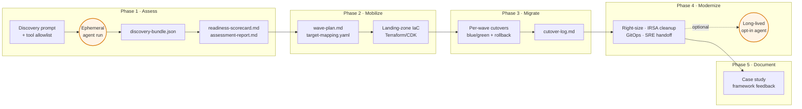
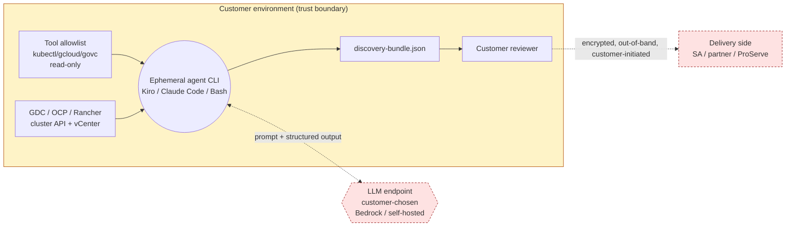
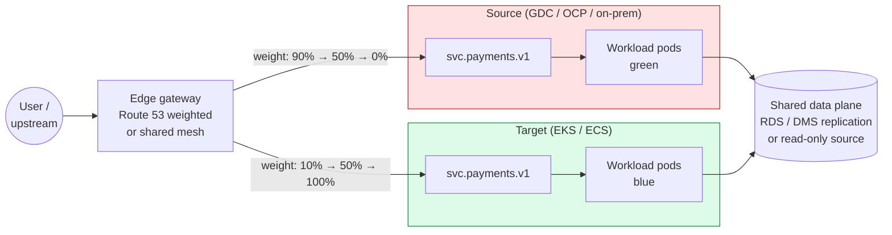

# ACMF Reference Architecture Diagrams

These diagrams are the canonical visuals for the ACMF methodology. They
render natively on GitHub via Mermaid — no external image hosting, no
broken links over time.

If you change the methodology, change the diagram in the same PR. Out-of-date
visuals are worse than no visuals.

## 1. ACMF five-phase overview

The end-to-end shape of an engagement, from kickoff to case study. Agents
run inside Phase 1 and (optionally) Phase 4; every other box is a human
decision or deliverable.



**Reading guide:** Boxes in orange are agent-run; everything else is
human-authored or human-judged. The dashed arrow into Phase 4 is the only
optional persistent agent in the framework, and it is opt-in per
[`docs/CONSTITUTION.md`](../CONSTITUTION.md).

## 2. Source/target adapter model

ACMF normalises every source platform into a single discovery-bundle schema,
then the target adapters consume that schema to emit AWS-specific manifests
and IaC. Adding a new source or target is a matter of writing one adapter,
not rewriting the methodology.

```mermaid
flowchart LR
    subgraph SRC["Source adapters (read)"]
        AV[GDC<br/>for VMware]:::ready
        AG[GKE<br/>(GKE Enterprise)]:::planned
        OS[OpenShift]:::planned
        RC[Rancher / vanilla K8s]:::planned
    end

    SCH[(discovery-bundle.json<br/>schema v0.2.0)]:::schema

    subgraph TGT["Target adapters (write)"]
        EKS[Amazon EKS<br/>+ Auto Mode / Karpenter]:::ready
        ECS[Amazon ECS<br/>Fargate]:::ready
        APR[AWS App Runner ⛔<br/>maint. 2026-04-30]:::deprecated
    end

    AV --> SCH
    AG -.-> SCH
    OS -.-> SCH
    RC -.-> SCH
    SCH --> EKS
    SCH --> ECS
    SCH --> APR

    classDef ready fill:#dcfce7,stroke:#16a34a,stroke-width:2px;
    classDef planned fill:#f1f5f9,stroke:#94a3b8,stroke-dasharray:4 3;
    classDef deprecated fill:#fee2e2,stroke:#991b1b,stroke-dasharray:4 3;
    classDef schema fill:#dbeafe,stroke:#1d4ed8,stroke-width:2px;
```

**Reading guide:** Solid green = shipped today. Dashed grey = on the roadmap
([`ROADMAP.md`](../../ROADMAP.md)). The schema in the centre is the contract
— adapters change independently as long as they read or write the schema.

## 3. Discovery architecture (Phase 1 detail)

The trust boundary the customer cares about: nothing leaves the customer
environment unless they ship it. The agent runs once, writes a JSON file,
and exits.



**Reading guide:** The yellow box is the customer perimeter. Only two arrows
cross it: (a) the LLM call, against an endpoint the customer chose; (b) the
bundle handoff, encrypted and customer-initiated. There is no phone-home
channel and no persistent agent. See FAQ §"Security & data handling".

## 4. Phase 3 — progressive traffic shift

Per-wave cutover pattern. Source and target run in parallel behind a shared
mesh (or DNS) until weight reaches 100% on the target and the wave is
declared done. Rollback is "set weight back to 0%."



**Reading guide:** Both sides talk to the same data plane during the shift —
that's why data-migration patterns
([`docs/decisions/data-migration-patterns.md`](../decisions/data-migration-patterns.md))
must be settled in Phase 2, not Phase 3. Rollback is a weight change, not
a redeploy.

---

## How to update these

1. Edit the Mermaid block(s) in this file.
2. Verify rendering on GitHub by viewing the file in the PR preview.
3. If you add a new diagram, link it from the README and the
   [`acmf-overview-1pager.md`](../customer-facing/acmf-overview-1pager.md).
4. Keep diagrams under ~25 nodes each — past that, split into a sub-diagram.
